# Projet de Rendu 3D avec Calcul d'Éclairement (Version Python)

Ce projet implémente un moteur de rendu 3D simple en Python, capable de calculer l'éclairement d'objets maillés avec gestion des ombres portées et tessellation adaptative.

## Vue d'ensemble

Le projet se décompose en 4 travaux dirigés (TD) progressifs qui permettent de construire un système complet de visualisation et d'éclairage d'objets 3D :

1. **TD1** : Manipulation de triangles et d'objets polyédriques
2. **TD2** : Calcul d'éclairement direct (sans ombres)
3. **TD3** : Calcul d'ombres portées par intersection rayon-triangle
4. **TD4** : Tessellation adaptative et rendu final

## Installation

### Prérequis

- Python 3.7 ou supérieur
- pip (gestionnaire de paquets Python)

### Création d'un environnement virtuel (recommandé)

Il est fortement recommandé d'utiliser un environnement virtuel pour isoler les dépendances du projet.

#### Sur Windows

```bash
# Créer l'environnement virtuel
python -m venv .venv

# Activer l'environnement virtuel
.venv\Scripts\activate
```

#### Sur macOS/Linux

```bash
# Créer l'environnement virtuel
python3 -m venv .venv

# Activer l'environnement virtuel
source .venv/bin/activate
```

Une fois l'environnement activé, vous verrez `(.venv)` au début de votre ligne de commande.

Pour désactiver l'environnement virtuel plus tard :
```bash
deactivate
```

### Installation des dépendances

Une fois l'environnement virtuel activé, installez les dépendances :

```bash
pip install -r requirements.txt
```

Les bibliothèques requises sont :
- **numpy** : calculs vectoriels et matriciels
- **matplotlib** : visualisation 3D
- **trimesh** : lecture de fichiers STL

## Structure des données

Tous les objets 3D sont représentés par deux matrices numpy :
- **sommets** : matrice (N × 3) où chaque ligne contient les coordonnées (x, y, z) d'un sommet
- **triangles** : matrice (M × 3) où chaque ligne contient les indices de 3 sommets formant un triangle

Cette représentation est compatible avec le format retourné par `trimesh`.

## Convention de nommage

Toutes les fonctions suivent la convention Python snake_case :
- Exemple : `calcul_centre_de_gravite`, `affichage_objet_eclaire`

## Gestion des figures

**Principe important** : Les figures sont créées dans les scripts de test avec `figure()`.

- Utiliser `figure()` pour créer une nouvelle figure 3D configurée
- Toutes les fonctions `affichage_*` dessinent dans les axes fournis
- Utiliser `plt.show()` pour afficher les figures

## TD1 : Manipulation de triangles et objets 3D

### Objectifs
- Manipuler des triangles individuels
- Créer et afficher des objets polyédriques simples
- Comprendre la représentation sommets/triangles

### Fonctions implémentées
- `calcul_centre_de_gravite(A, B, C)` : Calcule le centre de gravité d'un triangle
- `calcul_normale_triangle(A, B, C)` : Calcule la normale unitaire d'un triangle
- `affichage_triangle(A, B, C, ax)` : Affiche un triangle avec sa normale
- `creer_pyramide(base, hauteur)` : Crée une pyramide à base carrée
- `affichage_objet(sommets, triangles, ax)` : Affiche un objet avec toutes ses normales
- `recupere_sommets(ind, sommets, triangles)` : Extrait les coordonnées des 3 sommets d'un triangle

### Exécution

```bash
python td1.py
```

### Résultats

| Triangle simple | Pyramide |
|----------------|----------|
| 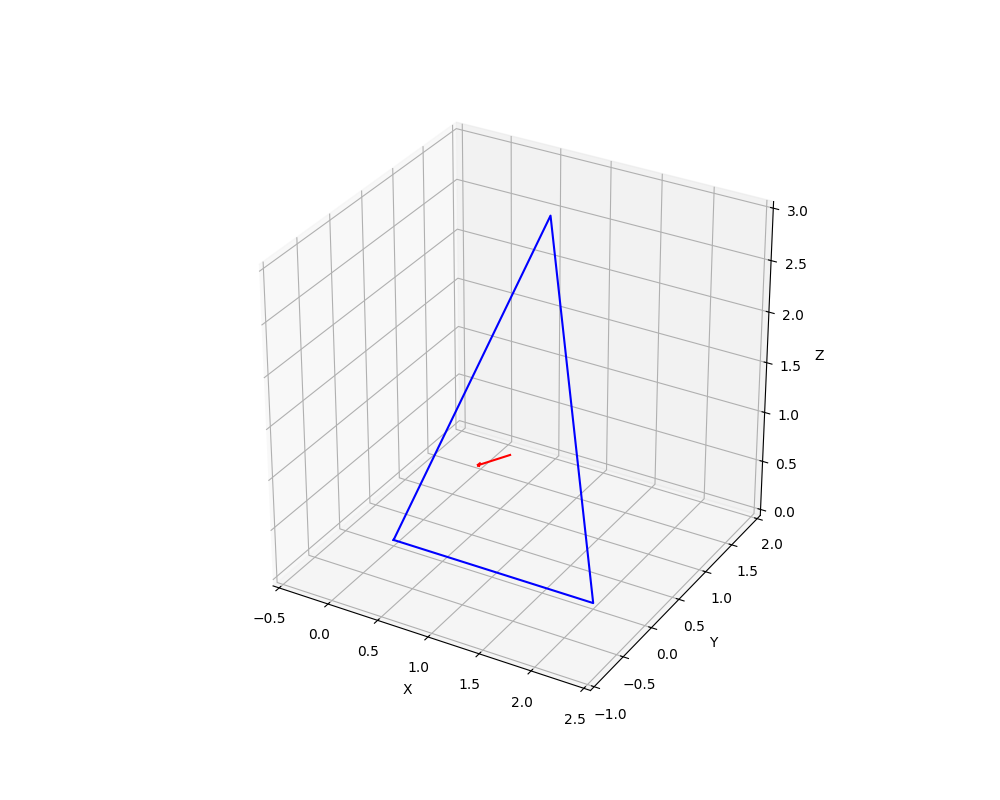 | 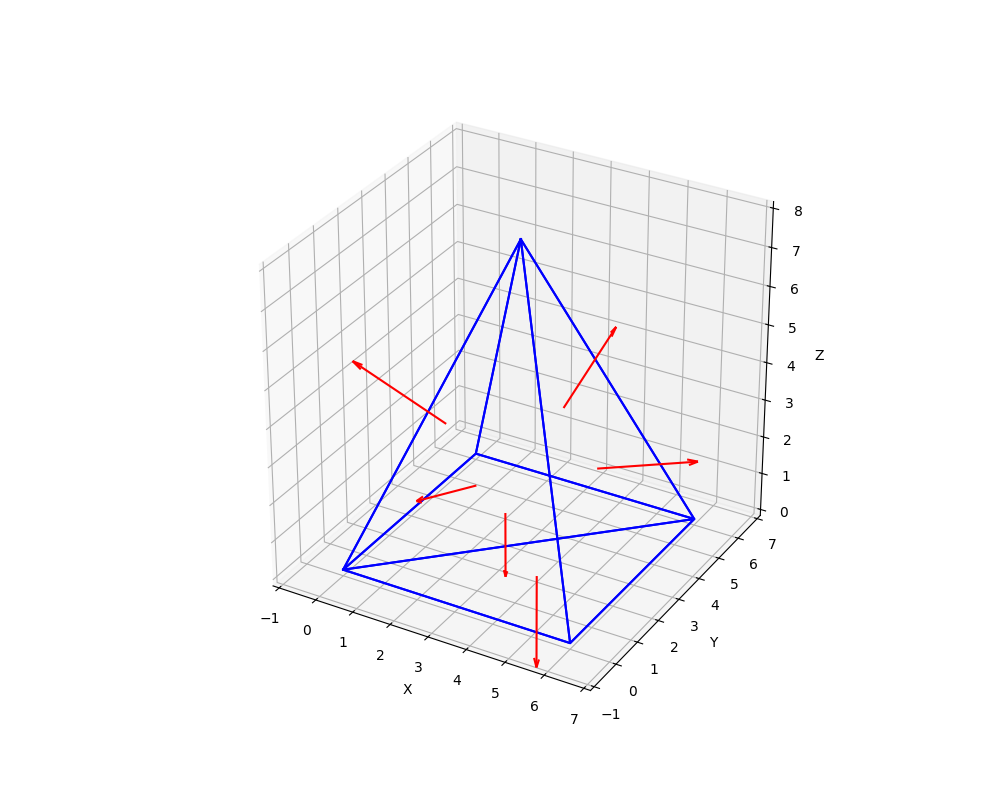 |

## TD2 : Calcul et affichage de l'éclairement

### Objectifs
- Calculer l'éclairement direct d'une surface
- Visualiser l'éclairement avec une colormap
- Travailler avec des modèles 3D complexes (fichiers STL)

### Modèle d'éclairement
L'éclairement d'un triangle dépend de l'angle entre :
- La normale au triangle
- Le vecteur allant du centre du triangle vers la source lumineuse

Formule : `E = max(0, cos(θ))`

où θ est l'angle entre la normale et le vecteur vers la source.

### Fonctions implémentées
- `calcul_eclairement_triangle(A, B, C, source)` : Éclairement d'un triangle
- `calcul_eclairement_objet_simple(sommets, triangles, source)` : Éclairement sans ombres
- `affichage_objet_eclaire(sommets, triangles, E, source, ax)` : Affichage avec colormap

### Exécution

```bash
python td2.py
```

### Résultats

| Pyramide éclairée | Bâtiment sans ombres | Bâtiment avec normales |
|-------------------|---------------------|------------------------|
| 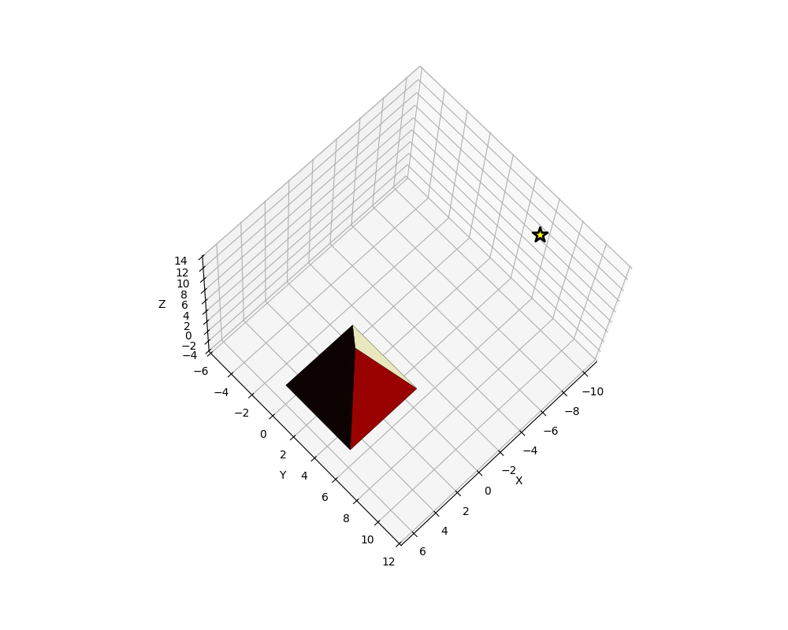 | 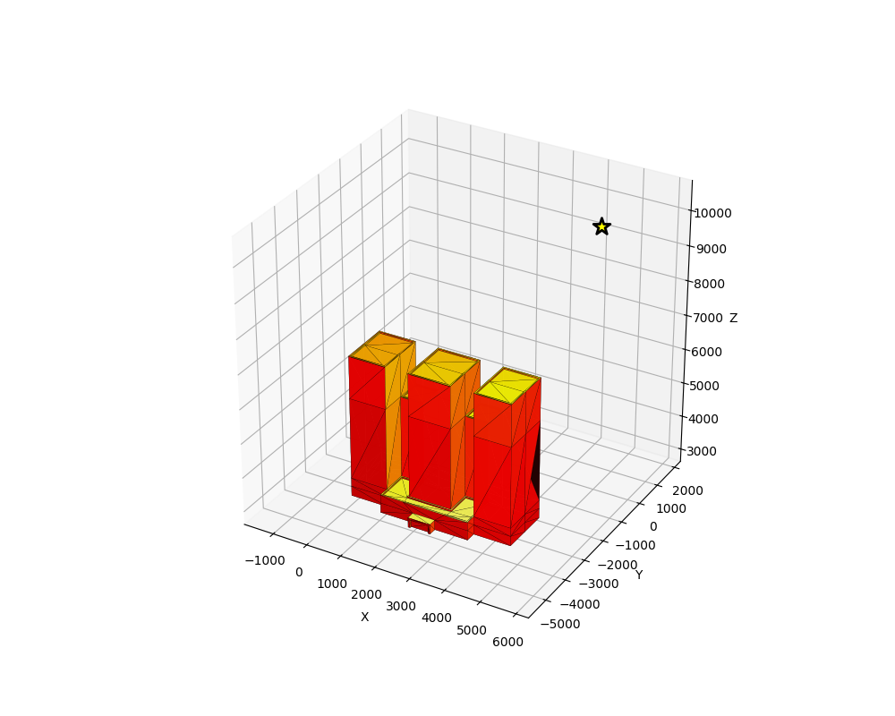 | 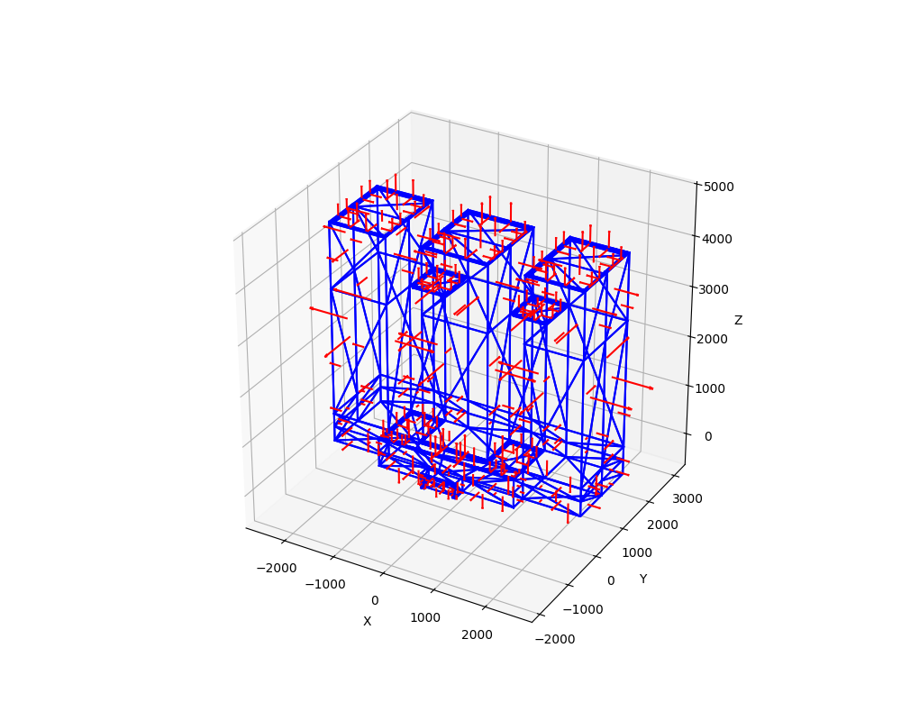 |

## TD3 : Calcul des ombres portées

### Objectifs
- Implémenter l'intersection rayon-triangle
- Détecter les ombres portées
- Améliorer le réalisme du rendu

### Algorithme d'intersection
Pour chaque triangle éclairé :
1. Tracer un rayon entre le centre du triangle et la source
2. Tester si ce rayon intersecte un autre triangle
3. Si oui, le triangle est à l'ombre : éclairement = 0

### Fonctions implémentées
- `calcul_intersection_triangle_segment(A, B, C, P1, P2)` : Test d'intersection
- `calcul_eclairement_objet(sommets, triangles, source)` : Éclairement avec ombres

### Exécution

```bash
python td3.py
```

**Note** : Le calcul des ombres peut prendre quelques secondes sur des modèles complexes.

### Résultats

| Tests d'intersection | Bâtiment avec ombres |
|---------------------|---------------------|
| 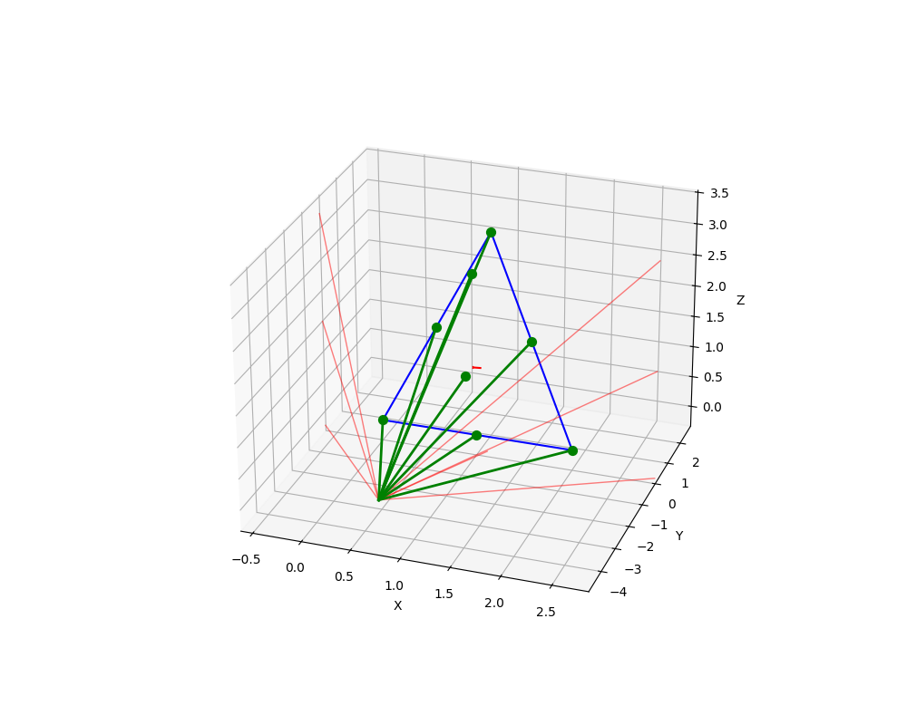 | 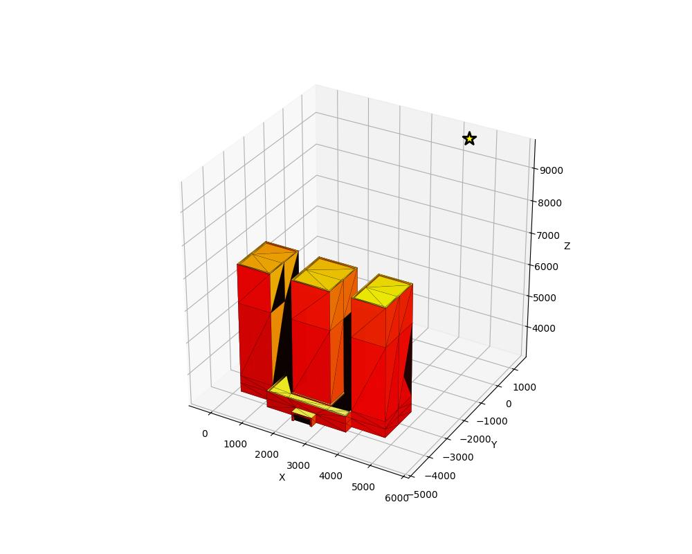 |

## TD4 : Tessellation et rendu final

### Objectifs
- Raffiner le maillage pour améliorer la qualité du rendu
- Fusionner plusieurs objets (bâtiment + sol)
- Créer un rendu final de haute qualité

### Tessellation adaptative
La tessellation subdivise récursivement les triangles dont la surface dépasse un seuil :
- Chaque triangle est divisé en 4 sous-triangles
- Le processus continue jusqu'à ce que tous les triangles respectent le critère

### Fonctions implémentées
- `calcul_surface_triangle(A, B, C)` : Calcule l'aire d'un triangle
- `tessellation_triangle(ind, sommets, triangles)` : Subdivise un triangle
- `tessellation_objet(sommets, triangles, surf_min)` : Raffine un maillage complet
- `creer_sol(p1, p2)` : Crée un plan horizontal
- `creer_concatenation(s1, t1, s2, t2)` : Fusionne deux objets

### Exécution

```bash
python td4.py
```

**Note** : Le calcul avec tessellation peut prendre plusieurs secondes (utiliser tqdm pour afficher la progression dans la console).

### Résultats

| Tessellation d'un triangle | Tessellation d'un objet |
|---------------------------|------------------------|
| 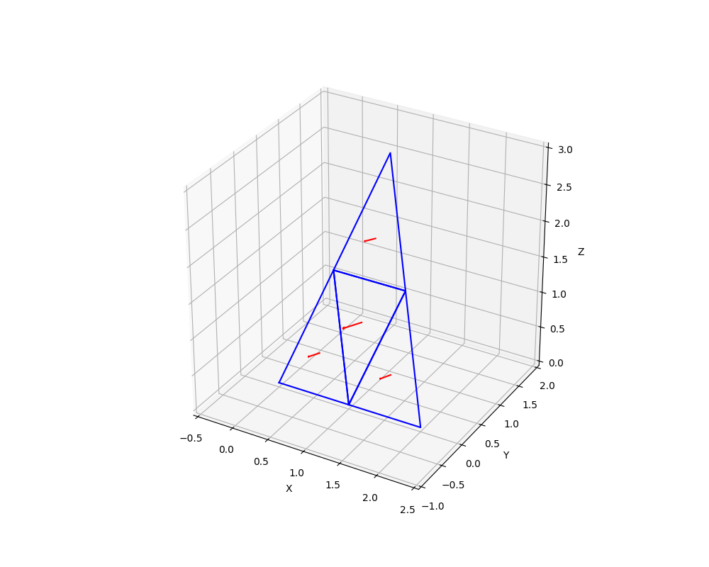 | 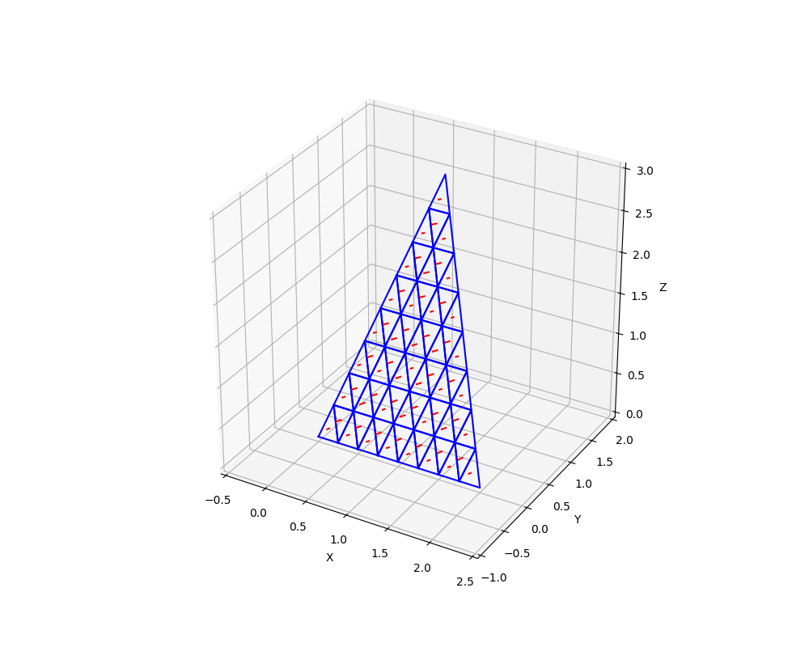 |

| Bâtiment avec sol | Rendu final avec tessellation |
|-------------------|------------------------------|
| 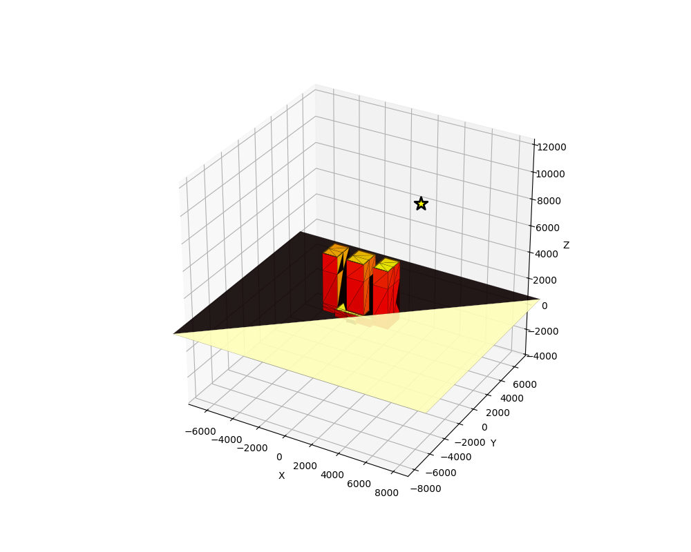 | 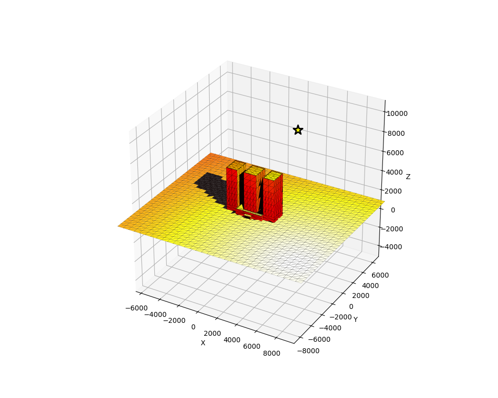 |

## Utilisation

**Important** : Assurez-vous d'avoir activé l'environnement virtuel avant d'exécuter les scripts :
```bash
# Sur Windows
venv\Scripts\activate

# Sur macOS/Linux
source venv/bin/activate
```

### Exécuter tous les TD

```bash
python td1.py
python td2.py
python td3.py
python td4.py
```

### Exemple d'utilisation du module

```python
import numpy as np
from stl import mesh
from geometry import *

# Charger un modèle 3D
stl_mesh = mesh.Mesh.from_file('building.stl')
# (code d'extraction des sommets/triangles)

# Définir une source lumineuse proportionnelle à la taille de l'objet
pmax = np.max(sommets, axis=0)
source = pmax * 3

# Calculer l'éclairement avec ombres
E = calcul_eclairement_objet(sommets, triangles, source)

# Afficher le résultat
fig, ax = figure()
affichage_objet_eclaire(sommets, triangles, E, source, ax)
plt.show()
```

## Principes de conception

### Pas de valeurs en dur
**Important** : Ne jamais coder de valeurs en dur (surface min, position de source).
Toujours calculer ces valeurs en fonction des dimensions de l'objet.

Exemple pour la position de la source :
```python
pmax = np.max(sommets, axis=0)
source = pmax * 3  # Source à 3× la dimension maximale
```

Exemple pour la surface minimale de tessellation :
```python
# Trouver la plus grande surface
s_max = 0
for i in range(len(triangles)):
    A, B, C = recupere_sommets(i, sommets, triangles)
    s = calcul_surface_triangle(A, B, C)
    s_max = max(s_max, s)

# Choisir 1/10 de la plus grande surface
surf_min = s_max / 10
```

## Structure du projet

```
python/
├── geometry.py          # Module contenant toutes les fonctions
├── td1.py              # TD1 : Triangles et pyramide
├── td2.py              # TD2 : Éclairement direct
├── td3.py              # TD3 : Ombres portées
├── td4.py              # TD4 : Tessellation et rendu final
├── building.stl        # Modèle 3D de test
├── requirements.txt    # Dépendances Python
├── README.md          # Ce fichier
├── CLAUDE.md          # Guide pour Claude Code
└── venv/               # Environnement virtuel (à exclure du repository)
```

**Note** : Pensez à ajouter `venv/` à votre `.gitignore` pour ne pas versionner l'environnement virtuel.

## Données

- `building.stl` - Modèle 3D de bâtiment pour les tests

## Performance

Les algorithmes implémentés sont en O(n²) pour le calcul des ombres (chaque triangle teste l'intersection avec tous les autres). Pour des modèles très détaillés, le temps de calcul peut être significatif.

Optimisations possibles :
- Utilisation de structures spatiales (octree, BVH)
- Parallélisation avec multiprocessing
- Utilisation de Numba pour la compilation JIT

## Différences avec la version MATLAB

- Utilisation de numpy pour les calculs vectoriels
- Matplotlib au lieu de MATLAB plotting
- trimesh pour la lecture de fichiers STL
- Convention de nommage snake_case
- Gestion explicite des axes matplotlib

## Licence

Ce projet est fourni à des fins éducatives.
